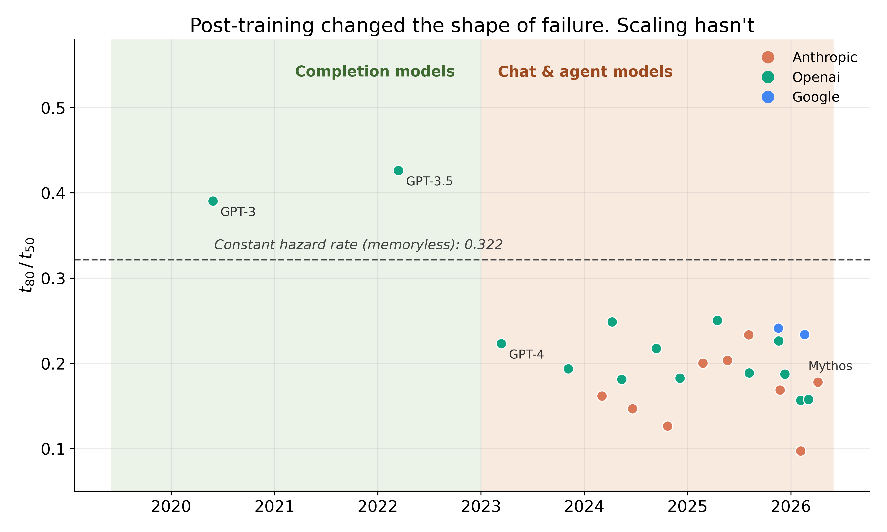
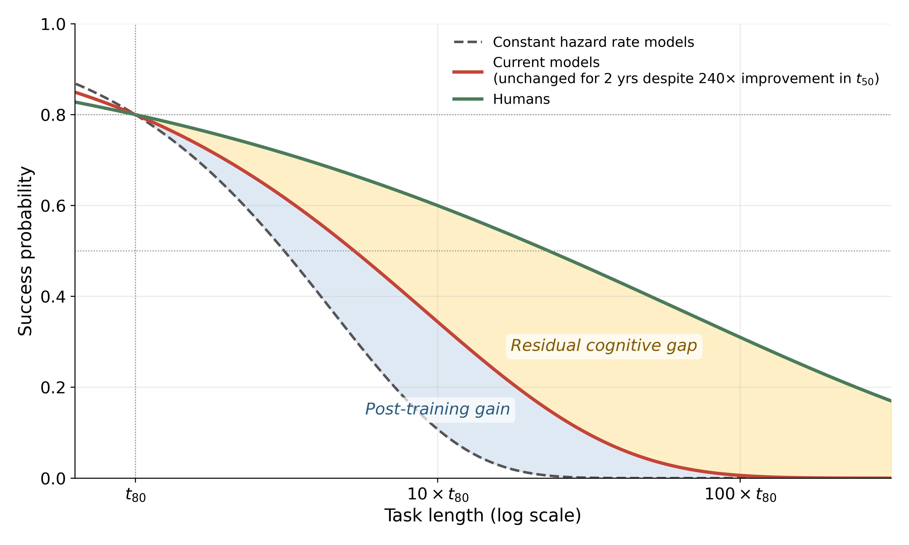

# cognitive-dark-matter-figures

Code and data to reproduce the two time-horizon figures in the accompanying
manuscript (citation to be added on publication).

| Figure | Output | What it shows |
|---|---|---|
| t80/t50 ratio over time | `figures/ratio_over_time.{pdf,svg,png}` | Ratio of each model's 80%- to 50%-success time horizon vs. release date, against the constant-hazard-rate prediction ln 0.8 / ln 0.5 ≈ 0.322 |
| Success vs. task length | `figures/success_vs_task_length.{pdf,svg,png}` | Success probability vs. task length in units of t80 for constant-hazard-rate models, current models and humans, showing the post-training gain and the residual cognitive gap |




## Reproduce

Requires Python ≥ 3.10.

```bash
git clone https://github.com/sean-escola/cognitive-dark-matter-figures.git
cd cognitive-dark-matter-figures
python -m venv .venv && source .venv/bin/activate
pip install -r requirements.txt
python make_figures.py
```

This rewrites everything in `figures/` (runtime: a few seconds). With the pinned
package versions the output is deterministic, so `git status` should report no
changes afterwards.

## Data

`data/benchmark_results_1_1.yaml` is an unmodified copy of METR's public
Time Horizon 1.1 results file,
<https://metr.org/assets/benchmark_results_1_1.yaml>, described at
<https://metr.org/time-horizons/> (METR release of 8 May 2026, 26 models; verified
byte-identical to the file served by METR on 17 September 2026).

SHA-256: `aae31902b0519a4da73e16643915e5e8aca13cd3315c3aac893ce3d6dfe92ad9`

The script uses each model's `release_date` and the point estimates of
`p50_horizon_length` and `p80_horizon_length` (minutes). GPT-2 is omitted from
the ratio figure. The data belong to METR; if you use them, please cite METR
(references below).

## Method notes

- **Constant hazard rate.** If failures arrive at a constant rate, success decays
  exponentially with task length and t80/t50 = ln 0.8 / ln 0.5 ≈ 0.322 (Ord, 2025).
- **Success curves.** Weibull survival functions anchored at t80,
  S(t) = 0.8^((t/t80)^k), with shape k = 1 for a constant hazard rate; k = 0.68
  for current models, from the mean t80/t50 ≈ 0.19 of models released since 2023
  (k = ln 0.322 / ln 0.19); and k = 0.36 for humans, from the human baseline data
  of Kwa et al. (2025) (t50 = 1.5 h and S(16 h) = 0.20).

## References

- Kwa, T. et al. Measuring AI Ability to Complete Long Software Tasks.
  arXiv:2503.14499 (2025).
- METR. Task-Completion Time Horizons of Frontier AI Models.
  <https://metr.org/time-horizons/> (2026).
- Ord, T. Is there a half-life for the success rates of AI agents?
  arXiv:2505.05115 (2025).

## License

Code: MIT (see `LICENSE`). The data file is METR's and is not covered by this
license.
